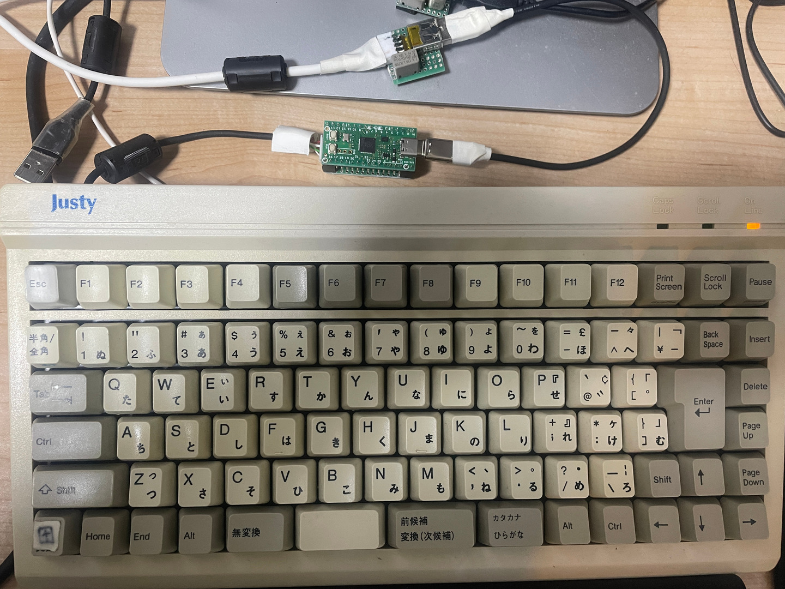

# これは何

オリジナルはこちらです。
https://github.com/rowol/picow_ps2kb_to_ble_usb

こちらは pico w を使って Bluetooth にも対応してますが、pico w が microB なのが嫌なので、秋
月の RP2040 マイコンボードキット (Pico 相当) で動かせるように、しようとしています。

オリジナルの README.md はこちらです。
[README.org.md](./README.org.md)

# 注意

- まだ検討してるだけで、実際の動作は不明です。
- 自分のことで精一杯です。
  - 参考にしてもらえたら嬉しいですが、Issue とか Commit とかは送られても対処できません。

# 対象キーボードとチューニング

- Justy JKB-89S 
- Caps lock は 左田キー
  - オリジナルは、「何もしない」。たぶん嫌いなんだと思います。
- JIS 専用キーを追加
- Print screen を追加
- リセット掛けてから 0xAA (準備OK) を待つことにする
  - オリジナルは、キーボードに対しては何も働き掛けない。
  - [atudb_jp](https://github.com/Nobutarou/at2usb_jp) と同様の処理

# ソースに関するメモ

- [CMakeLists.txt](./CMakeLists.txt) を書き換えて USB 対応、Pico 対応をする
- [ps2kbd-lib/ps2.c](./ps2kbd-lib/ps2.c) で、PS/2 スキャンコードと HIS コードの対応を作る
  - [ps/2 スキャンコード](https://www.ne.jp/asahi/shared/o-family/ElecRoom/AVRMCOM/PS2_RS232C/KeyCordList.pdf)
  - [hid コード](https://bsakatu.net/doc/usb-hid-to-scancode/)
  - にらめっこ
- 0xFF を送って 0xAA を待つような処理はしていない
  - kbd_write_byte() 関数はある。
  - kbd_ready() が名前と裏腹に scancode を取得する
- Pause キーを真面目に処理するなら ps2.c の ps2_task() 関数内でやるべきだろう。
  - やるなら E1 が来たら 7回スルーすれば良い
  - 物理的に押せなくしてあるから、やらない

# ハード 1.0

AE-RP2040 の上にソケットを出すか、下にヘッダを出すか悩んだが、RUN (リセット) ピンが横に出
ていないため、上に何か載せると、指が入らずリセットできなくなるかもしれない。そこで、下にピ
ンを出すことにする。

それで、ソケットは長いやつにしようと思う。AE-RP2040 はけっこう大きいから、その下に配線詰め
込めないのは勿体ない。

あと、Pico は一応 GPIO 3.3V だから、ツェナーを入れることにする。オリジナルの作者さんは直結
してるみたいに思うから、動くんだろうし 1kΩとか入れておけば、まず壊れることは無いとは思う
けど、Pico の下はスペースがあるので、削る必要もない。

[回路図](./hard/v1.0/Pico_Ps2kb_to_USB_1.0/Pico_Ps2kb_to_USB_1.0_Schematics.pdf)

[設計図](./hard/v1.0/hard_v1.0.pdf)

部品表

| 記号 | 品目、品名、品番等 | 個数 |
| ---  | ---  | --- |
| B1 | ユニバーサル基板 17x8P | 1 |
| D1,2 | ツェナー 3.3V | 2 |
| R1,2 | 抵抗 300Ω | 2 |
| S1-4 | ピンソケット 2P | 4 |
| X1 | X1 ポスト 4P | 1 |

